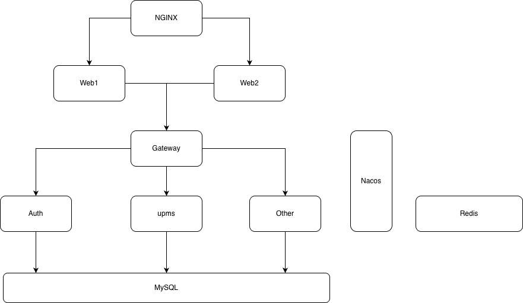

# Achitect

[架构](pig.drawio)

# 表设计

### 表结构

- [配置表](../db/pig_config.sql)
- [基础表](../db/pig.sql)

### 表结构分析

- [脚本](../db/00_parse_sql.py)
- [ER 图](../db/00_pig-er-diagram.puml)
- [Excel 版表](../db/00_pig表结构.csv)

# 关键流程

- [授权码模式流程](pig-auth-auth-sequence.puml#L5)

- [Refresh Token 刷新流程](pig-auth-auth-sequence.puml#L33)

- [内部架构](pig-auth-auth-sequence.puml#L56)

- [302/401 判断逻辑](pig-auth-auth-sequence.puml#L78)

# 调研

[调研结果](02_pig.xlsx)

# OAuth2.0 接入
[resource server 接入 ](pig_resource_server_user_oauth.md)

# TODO
1. 怎么通过网关进行统一登录 (Done)